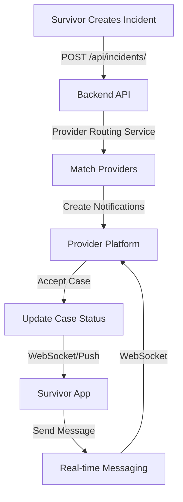

# Kintaraa Platform System Architecture & Separation Strategy

**Document Version:** 1.0
**Date:** October 20, 2025
**Purpose:** System design for separating survivor and provider platforms while maintaining seamless integration

---

## Table of Contents

1. [Executive Summary](#executive-summary)
2. [Current Architecture Analysis](#current-architecture-analysis)
3. [Proposed Separation Architecture](#proposed-separation-architecture)
4. [Data Sharing & Communication Strategy](#data-sharing--communication-strategy)
5. [Implementation Roadmap](#implementation-roadmap)
6. [Security & Privacy Considerations](#security--privacy-considerations)
7. [Technical Specifications](#technical-specifications)
8. [Migration Strategy](#migration-strategy)

---

## 1. Executive Summary

### Current State

Kintaraa currently operates as a **monolithic React Native application** that serves both survivors and 7 different provider types (healthcare, legal, police, counseling, social services, GBV rescue, and community health workers) through a single codebase with role-based routing.

### Proposed State

**Two separate applications** connected through a unified backend API:

1. **Kintaraa Survivor App** - Mobile-first application for GBV survivors
2. **Kintaraa Provider Platform** - Multi-provider specialist application (mobile + web)

### Benefits of Separation

| Aspect              | Current Monolith                | Separated Architecture           |
| ------------------- | ------------------------------- | -------------------------------- |
| **Bundle Size**     | ~50MB (all roles)               | Survivor: ~15MB, Provider: ~35MB |
| **Security**        | Shared codebase risks           | Isolated security boundaries     |
| **Deployment**      | Single deployment affects all   | Independent deployment cycles    |
| **Scalability**     | Coupled scaling                 | Independent horizontal scaling   |
| **Development**     | Tight coupling, merge conflicts | Parallel development teams       |
| **User Experience** | One-size-fits-all               | Role-optimized experiences       |

---

## 2. Current Architecture Analysis

### 2.1 Directory Structure Breakdown

```
kintaraa-app/
├── app/                                    # Expo Router - SHARED
│   ├── (auth)/                            # Authentication - SHARED
│   │   ├── welcome.tsx
│   │   ├── login.tsx
│   │   └── register.tsx
│   │
│   ├── (dashboard)/                       # Dashboards - NEEDS SEPARATION
│   │   ├── survivor/                      # → SURVIVOR APP
│   │   │   ├── index.tsx
│   │   │   ├── reports.tsx
│   │   │   ├── wellbeing.tsx
│   │   │   ├── safety.tsx
│   │   │   └── profile.tsx
│   │   │
│   │   ├── healthcare/                    # → PROVIDER PLATFORM
│   │   ├── legal/                         # → PROVIDER PLATFORM
│   │   ├── police/                        # → PROVIDER PLATFORM
│   │   ├── counseling/                    # → PROVIDER PLATFORM
│   │   ├── social/                        # → PROVIDER PLATFORM
│   │   ├── gbv_rescue/                    # → PROVIDER PLATFORM
│   │   └── chw/                           # → PROVIDER PLATFORM
│   │
│   ├── report.tsx                         # Incident reporting - SURVIVOR SPECIFIC
│   ├── emergency.tsx                      # Emergency features - SURVIVOR SPECIFIC
│   ├── journal.tsx                        # Wellbeing journal - SURVIVOR SPECIFIC
│   ├── case-details/[id].tsx              # Case management - SHARED (different views)
│   └── messages/[id].tsx                  # Messaging - SHARED
│
├── dashboards/                            # Business logic - NEEDS SEPARATION
│   ├── survivor/                          # → SURVIVOR APP
│   │   └── components/
│   │       ├── DashboardOverview.tsx
│   │       ├── CaseManagement.tsx
│   │       ├── SafetyTools.tsx
│   │       ├── SupportServices.tsx
│   │       └── ResourceViewer.tsx
│   │
│   ├── healthcare/                        # → PROVIDER PLATFORM
│   ├── legal/                             # → PROVIDER PLATFORM
│   ├── police/                            # → PROVIDER PLATFORM
│   ├── counseling/                        # → PROVIDER PLATFORM
│   ├── social/                            # → PROVIDER PLATFORM
│   ├── gbv_rescue/                        # → PROVIDER PLATFORM
│   └── chw/                               # → PROVIDER PLATFORM
│
├── providers/                             # React Context - NEEDS ANALYSIS
│   ├── AuthProvider.tsx                   # → SHARED (via API)
│   ├── IncidentProvider.tsx               # → PARTIALLY SHARED
│   ├── WellbeingProvider.tsx              # → SURVIVOR APP ONLY
│   ├── SafetyProvider.tsx                 # → SURVIVOR APP ONLY
│   ├── RecommendationProvider.tsx         # → SURVIVOR APP ONLY
│   └── ProviderContext.tsx                # → PROVIDER PLATFORM ONLY
│
├── services/                              # API Services - TO BE MOVED TO BACKEND
│   ├── api.ts                             # → SHARED (base API client)
│   ├── authService.ts                     # → SHARED
│   ├── providerRouting.ts                 # → BACKEND SERVICE
│   ├── notificationService.ts             # → BACKEND SERVICE
│   └── providerResponseService.ts         # → BACKEND SERVICE
│
├── constants/                             # Configuration - SHARED
│   ├── config.ts                          # → SHARED (different configs per app)
│   └── DummyData.ts                       # → TO BE REMOVED (replaced by API)
│
└── assets/                                # Static assets - NEEDS SEPARATION
    └── documents/                         # → SURVIVOR APP (forms, resources)
```

### 2.2 Code Ownership Matrix

| Component              | Survivor App  | Provider Platform   | Shared | Backend |
| ---------------------- | ------------- | ------------------- | ------ | ------- |
| **Authentication**     | ✓             | ✓                   | ✓      | ✓       |
| **Incident Reporting** | ✓             | -                   | -      | ✓       |
| **Case Management**    | ✓ (read-only) | ✓ (full access)     | -      | ✓       |
| **Messaging**          | ✓             | ✓                   | ✓      | ✓       |
| **Wellbeing Tracking** | ✓             | -                   | -      | ✓       |
| **Safety Planning**    | ✓             | -                   | -      | ✓       |
| **Provider Routing**   | -             | -                   | -      | ✓       |
| **Notifications**      | ✓             | ✓                   | -      | ✓       |
| **Analytics**          | ✓ (personal)  | ✓ (professional)    | -      | ✓       |
| **Learning Resources** | ✓             | -                   | -      | -       |
| **Emergency Features** | ✓             | ✓ (GBV Rescue only) | -      | ✓       |

### 2.3 Data Flow Analysis



**Current Issues:**

- ❌ Provider routing logic in frontend (`services/providerRouting.ts`)
- ❌ Notification creation in frontend (`services/notificationService.ts`)
- ❌ Mock data in React Context providers
- ❌ Shared state between survivor and provider views
- ❌ No clear API boundaries

---

## 3. Proposed Separation Architecture

### 3.1 High-Level System Design

```
┌─────────────────────────────────────────────────────────────────────────┐
│                          KINTARAA ECOSYSTEM                             │
└─────────────────────────────────────────────────────────────────────────┘

┌──────────────────────┐              ┌──────────────────────────────────┐
│   SURVIVOR APP       │              │   PROVIDER PLATFORM              │
│   (React Native)     │              │   (React Native + Web)           │
├──────────────────────┤              ├──────────────────────────────────┤
│ • Incident Reporting │              │ • Case Management                │
│ • Wellbeing Tracking │              │ • Appointment Scheduling         │
│ • Safety Planning    │              │ • Provider-Specific Workflows    │
│ • Resource Library   │              │ • Analytics Dashboard            │
│ • Emergency Features │              │ • Multi-provider Tools           │
│ • Messaging          │              │ • Messaging & Collaboration      │
└──────────┬───────────┘              └────────────┬─────────────────────┘
           │                                       │
           │ HTTPS/WSS                             │ HTTPS/WSS
           │                                       │
           └───────────────┬───────────────────────┘
                          │
                          ▼
           ┌────────────────────────────────┐
           │      API GATEWAY               │
           │   (Load Balancer + Auth)       │
           └────────────────┬───────────────┘
                           │
           ┌───────────────┴────────────────┐
           │                                │
           ▼                                ▼
┌──────────────────────┐      ┌──────────────────────────┐
│  BACKEND SERVICES    │      │   SHARED SERVICES        │
│  (Django REST API)   │      │                          │
├──────────────────────┤      ├──────────────────────────┤
│ • Authentication     │      │ • WebSocket Server       │
│ • Incident Mgmt      │      │ • Push Notifications     │
│ • Case Assignment    │      │ • File Storage (S3)      │
│ • Provider Routing   │      │ • Email/SMS Service      │
│ • Analytics Engine   │      │ • AI Recommendations     │
└──────────┬───────────┘      └───────────┬──────────────┘
           │                              │
           └──────────────┬───────────────┘
                         │
                         ▼
           ┌────────────────────────────────┐
           │     DATABASE LAYER             │
           ├────────────────────────────────┤
           │ • PostgreSQL (Primary)         │
           │ • Redis (Cache & Sessions)     │
           │ • MongoDB (Logs & Analytics)   │
           └────────────────────────────────┘
```

### 3.2 Application Structure

#### **3.2.1 Survivor App Structure**

```
kintaraa-survivor-app/
├── app/
│   ├── (auth)/
│   │   ├── login.tsx
│   │   └── register.tsx
│   │
│   ├── (tabs)/
│   │   ├── home.tsx                    # Dashboard overview
│   │   ├── my-cases.tsx                # Incident reports
│   │   ├── wellbeing.tsx               # Mental health tools
│   │   ├── resources.tsx               # Learning resources
│   │   └── profile.tsx                 # User profile
│   │
│   ├── report-incident.tsx             # Full incident reporting flow
│   ├── emergency.tsx                   # Emergency SOS features
│   ├── safety-plan.tsx                 # Safety planning tools
│   ├── case/[id].tsx                   # Case detail view
│   ├── messages/[id].tsx               # Messaging with providers
│   └── recommendations.tsx             # AI recommendations
│
├── components/
│   ├── incident/
│   ├── wellbeing/
│   ├── safety/
│   └── resources/
│
├── lib/
│   ├── api/
│   │   ├── client.ts                   # API client (axios/fetch)
│   │   ├── incidents.ts                # Incident API calls
│   │   ├── messages.ts                 # Messaging API
│   │   └── wellbeing.ts                # Wellbeing API
│   │
│   ├── hooks/
│   │   ├── useIncidents.ts
│   │   ├── useMessages.ts
│   │   └── useWellbeing.ts
│   │
│   └── context/
│       ├── AuthContext.tsx
│       └── NotificationContext.tsx
│
├── assets/
│   ├── documents/                      # PDF forms, resources
│   └── images/
│
└── package.json
```

#### **3.2.2 Provider Platform Structure**

```
kintaraa-provider-platform/
├── app/
│   ├── (auth)/
│   │   ├── login.tsx
│   │   └── provider-registration.tsx
│   │
│   ├── (dashboard)/
│   │   ├── [provider-type]/            # Dynamic provider routes
│   │   │   ├── index.tsx               # Provider-specific dashboard
│   │   │   ├── cases/
│   │   │   │   ├── index.tsx           # Case list
│   │   │   │   └── [id].tsx            # Case detail
│   │   │   ├── calendar.tsx            # Appointments (if applicable)
│   │   │   ├── analytics.tsx           # Performance metrics
│   │   │   └── settings.tsx
│   │   │
│   │   └── shared/
│   │       ├── notifications.tsx
│   │       └── messages.tsx
│   │
│   ├── case/[id]/
│   │   ├── overview.tsx
│   │   ├── messages.tsx
│   │   ├── evidence.tsx                # Police/Legal only
│   │   └── timeline.tsx
│   │
│   └── profile.tsx
│
├── features/
│   ├── healthcare/                     # Healthcare-specific
│   ├── legal/                          # Legal-specific
│   ├── police/                         # Police-specific
│   ├── counseling/                     # Counseling-specific
│   ├── social/                         # Social services-specific
│   ├── gbv_rescue/                     # GBV rescue-specific
│   └── chw/                            # CHW-specific
│
├── lib/
│   ├── api/
│   │   ├── client.ts
│   │   ├── cases.ts
│   │   ├── assignments.ts
│   │   └── analytics.ts
│   │
│   ├── hooks/
│   │   ├── useCases.ts
│   │   ├── useAssignments.ts
│   │   └── useProviderAnalytics.ts
│   │
│   └── context/
│       ├── AuthContext.tsx
│       └── ProviderContext.tsx
│
└── package.json
```

### 3.3 Backend Architecture

#### **3.3.1 Django Project Structure**

```
kintaraa-backend/
├── config/
│   ├── settings/
│   │   ├── base.py
│   │   ├── development.py
│   │   └── production.py
│   ├── urls.py
│   └── wsgi.py
│
├── apps/
│   ├── authentication/
│   │   ├── models.py                   # User, Role, Provider Profile
│   │   ├── serializers.py
│   │   ├── views.py
│   │   └── urls.py
│   │
│   ├── incidents/
│   │   ├── models.py                   # Incident, Evidence
│   │   ├── serializers.py
│   │   ├── views.py
│   │   ├── routing.py                  # Provider routing logic
│   │   └── urls.py
│   │
│   ├── messaging/
│   │   ├── models.py                   # Message, Thread
│   │   ├── consumers.py                # WebSocket consumers
│   │   ├── serializers.py
│   │   └── routing.py
│   │
│   ├── notifications/
│   │   ├── models.py                   # Notification
│   │   ├── services.py                 # Push, SMS, Email
│   │   └── views.py
│   │
│   ├── wellbeing/
│   │   ├── models.py                   # Journal, MoodEntry
│   │   └── views.py
│   │
│   ├── providers/
│   │   ├── models.py                   # ServiceProvider, Specialization
│   │   ├── availability.py             # Availability logic
│   │   └── views.py
│   │
│   └── analytics/
│       ├── models.py                   # ProviderMetrics, SurvivorMetrics
│       └── views.py
│
├── services/
│   ├── routing_service.py              # Intelligent provider matching
│   ├── notification_service.py         # Multi-channel notifications
│   └── ai_recommendations.py           # AI-powered recommendations
│
└── requirements.txt
```

---

## 4. Data Sharing & Communication Strategy

### 4.1 API Endpoints Specification

#### **Authentication Service**

```
POST   /api/v1/auth/register/
POST   /api/v1/auth/login/
POST   /api/v1/auth/logout/
POST   /api/v1/auth/refresh/
GET    /api/v1/auth/me/
PUT    /api/v1/auth/me/
POST   /api/v1/auth/biometric/enable/
POST   /api/v1/auth/biometric/disable/
```

#### **Incident Management Service**

```
# Survivor endpoints
POST   /api/v1/incidents/                        # Create incident
GET    /api/v1/incidents/                        # List my incidents
GET    /api/v1/incidents/{id}/                   # Get incident detail
PUT    /api/v1/incidents/{id}/                   # Update incident
DELETE /api/v1/incidents/{id}/                   # Delete incident (before assignment)

# Provider endpoints
GET    /api/v1/provider/cases/                   # List assigned cases
GET    /api/v1/provider/cases/{id}/              # Get case detail
PUT    /api/v1/provider/cases/{id}/status/       # Update case status
POST   /api/v1/provider/cases/{id}/notes/        # Add case notes
GET    /api/v1/provider/assignments/             # Get pending assignments
POST   /api/v1/provider/assignments/{id}/accept/ # Accept assignment
POST   /api/v1/provider/assignments/{id}/decline/# Decline assignment
```

#### **Messaging Service**

```
GET    /api/v1/cases/{id}/messages/              # Get messages
POST   /api/v1/cases/{id}/messages/              # Send message
PATCH  /api/v1/messages/{id}/read/               # Mark as read
WS     /ws/cases/{id}/                           # WebSocket connection
```

#### **Notification Service**

```
GET    /api/v1/notifications/                    # List notifications
PATCH  /api/v1/notifications/{id}/read/          # Mark as read
DELETE /api/v1/notifications/{id}/               # Clear notification
POST   /api/v1/notifications/settings/           # Update notification preferences
```

#### **Wellbeing Service (Survivor only)**

```
GET    /api/v1/wellbeing/journal/
POST   /api/v1/wellbeing/journal/
GET    /api/v1/wellbeing/mood/
POST   /api/v1/wellbeing/mood/
GET    /api/v1/wellbeing/safety-plan/
PUT    /api/v1/wellbeing/safety-plan/
```

#### **Analytics Service**

```
# Survivor analytics
GET    /api/v1/analytics/survivor/dashboard/

# Provider analytics
GET    /api/v1/analytics/provider/dashboard/
GET    /api/v1/analytics/provider/performance/
GET    /api/v1/analytics/provider/cases-summary/
```

### 4.2 Real-Time Communication

#### **WebSocket Channels**

```python
# Channel routing (Django Channels)
websocket_urlpatterns = [
    # Case messaging
    path('ws/cases/<case_id>/', CaseConsumer.as_asgi()),

    # Provider notifications
    path('ws/provider/notifications/', ProviderNotificationConsumer.as_asgi()),

    # Survivor notifications
    path('ws/survivor/notifications/', SurvivorNotificationConsumer.as_asgi()),
]
```

#### **Event Types**

```typescript
// Survivor app events
type SurvivorEvent =
  | { type: "case.assigned"; caseId: string; providerId: string }
  | { type: "case.status_updated"; caseId: string; status: string }
  | { type: "message.received"; caseId: string; message: Message }
  | { type: "provider.responded"; caseId: string; response: string };

// Provider platform events
type ProviderEvent =
  | { type: "case.new_assignment"; assignmentId: string; caseId: string }
  | { type: "case.updated"; caseId: string }
  | { type: "message.received"; caseId: string; message: Message }
  | { type: "case.escalated"; caseId: string; priority: string };
```

### 4.3 Data Synchronization Strategy

#### **Offline-First Architecture**

```typescript
// Survivor App - Offline support
class OfflineManager {
  async createIncident(data: IncidentData) {
    // Save to local SQLite/AsyncStorage
    await localDB.incidents.create(data);

    // Queue for sync
    await syncQueue.add("incidents.create", data);

    // Attempt immediate sync if online
    if (await isOnline()) {
      await this.sync();
    }
  }

  async sync() {
    const pending = await syncQueue.getPending();

    for (const item of pending) {
      try {
        await api.post(item.endpoint, item.data);
        await syncQueue.markComplete(item.id);
      } catch (error) {
        // Retry logic
      }
    }
  }
}
```

### 4.4 Data Access Control

#### **Row-Level Security (PostgreSQL)**

```sql
-- Survivors can only see their own incidents
CREATE POLICY survivor_incidents_policy ON incidents
FOR SELECT
USING (auth.uid() = survivor_id);

-- Providers can only see assigned cases
CREATE POLICY provider_cases_policy ON cases
FOR SELECT
USING (
  EXISTS (
    SELECT 1 FROM case_assignments
    WHERE case_id = cases.id
    AND provider_id = auth.uid()
    AND status = 'accepted'
  )
);

-- Anonymity protection
CREATE POLICY anonymous_survivor_policy ON incidents
FOR SELECT
USING (
  CASE
    WHEN is_anonymous = true THEN auth.role() = 'provider'
    ELSE TRUE
  END
);
```

---

## 5. Implementation Roadmap

### Phase 1: Backend Foundation (Weeks 1-4)

**Week 1-2: Core Backend Setup**

- [ ] Set up Django project with Django REST Framework
- [ ] Configure PostgreSQL database
- [ ] Implement authentication service (JWT)
- [ ] Set up Redis for caching and sessions
- [ ] Configure CORS and API gateway

**Week 3-4: Core Services**

- [ ] Implement Incident Management API
- [ ] Implement Provider Routing Service
- [ ] Implement Messaging API (HTTP)
- [ ] Implement Notification Service
- [ ] Write API documentation (OpenAPI/Swagger)

**Deliverables:**

- ✅ Functional backend API
- ✅ API documentation
- ✅ Database schema
- ✅ Authentication working

---

### Phase 2: Real-Time Infrastructure (Weeks 5-6)

**Week 5: WebSocket Setup**

- [ ] Configure Django Channels
- [ ] Implement WebSocket consumers
- [ ] Set up Redis for channel layer
- [ ] Implement real-time messaging

**Week 6: Push Notifications**

- [ ] Integrate Firebase Cloud Messaging (FCM)
- [ ] Implement SMS service (Africa's Talking/Twilio)
- [ ] Implement email service (SendGrid)
- [ ] Create notification preferences API

**Deliverables:**

- ✅ Real-time messaging working
- ✅ Push notifications functional
- ✅ Multi-channel notification system

---

### Phase 3: Survivor App Separation (Weeks 7-10)

**Week 7-8: Create Survivor App**

- [ ] Initialize new React Native project
- [ ] Set up Expo Router
- [ ] Migrate survivor-specific screens
- [ ] Implement API client
- [ ] Integrate authentication

**Week 9: Core Features**

- [ ] Incident reporting flow
- [ ] Case management view
- [ ] Messaging interface
- [ ] Wellbeing tracking
- [ ] Safety planning tools

**Week 10: Polish & Testing**

- [ ] Offline support
- [ ] Push notification handling
- [ ] UI/UX refinement
- [ ] End-to-end testing
- [ ] Performance optimization

**Deliverables:**

- ✅ Standalone survivor app
- ✅ Offline-first functionality
- ✅ All survivor features migrated

---

### Phase 4: Provider Platform Separation (Weeks 11-14)

**Week 11-12: Create Provider Platform**

- [ ] Initialize new React Native/Expo project
- [ ] Set up web support (React Native Web)
- [ ] Migrate provider dashboards (7 types)
- [ ] Implement case management interface
- [ ] Set up provider-specific routing

**Week 13: Provider-Specific Features**

- [ ] Healthcare provider workflow
- [ ] Legal aid workflow
- [ ] Police investigation tools
- [ ] Counseling session management
- [ ] GBV rescue dispatch
- [ ] CHW field reporting

**Week 14: Analytics & Testing**

- [ ] Provider analytics dashboard
- [ ] Performance metrics
- [ ] Multi-provider testing
- [ ] Web responsive design
- [ ] Cross-platform testing

**Deliverables:**

- ✅ Standalone provider platform
- ✅ All 7 provider types functional
- ✅ Web and mobile support

---

### Phase 5: Integration & Migration (Weeks 15-16)

**Week 15: System Integration**

- [ ] End-to-end testing
- [ ] Load testing
- [ ] Security audit
- [ ] Data migration scripts
- [ ] Deployment automation

**Week 16: Launch Preparation**

- [ ] User acceptance testing
- [ ] Documentation
- [ ] Training materials
- [ ] Support system setup
- [ ] Gradual rollout plan

**Deliverables:**

- ✅ Fully integrated system
- ✅ Migration complete
- ✅ Ready for production

---

## 6. Security & Privacy Considerations

### 6.1 Application-Level Security

#### **Survivor App Security**

```typescript
// Biometric authentication
import * as LocalAuthentication from "expo-local-authentication";

class BiometricAuth {
  static async authenticate() {
    const hasHardware = await LocalAuthentication.hasHardwareAsync();
    const isEnrolled = await LocalAuthentication.isEnrolledAsync();

    if (hasHardware && isEnrolled) {
      const result = await LocalAuthentication.authenticateAsync({
        promptMessage: "Unlock Kintaraa",
        fallbackLabel: "Use Passcode",
      });

      return result.success;
    }

    return false;
  }
}

// Data encryption at rest
import * as SecureStore from "expo-secure-store";

class SecureStorage {
  static async saveSecure(key: string, value: string) {
    await SecureStore.setItemAsync(key, value, {
      keychainAccessible: SecureStore.WHEN_UNLOCKED,
    });
  }

  static async getSecure(key: string) {
    return await SecureStore.getItemAsync(key);
  }
}
```

#### **Provider Platform Security**

```typescript
// Role-based access control
class ProviderAuth {
  static checkAccess(
    provider: Provider,
    resource: Resource,
    action: "view" | "edit" | "delete"
  ): boolean {
    // Healthcare can only access medical cases
    if (provider.type === "healthcare") {
      return resource.type === "medical" && action !== "delete";
    }

    // Police have read-only access to all cases
    if (provider.type === "police") {
      return action === "view";
    }

    // etc...
    return false;
  }
}
```

### 6.2 API Security

```python
# Django REST Framework permissions
from rest_framework import permissions

class IsSurvivorOwner(permissions.BasePermission):
    """Survivor can only access their own incidents"""

    def has_object_permission(self, request, view, obj):
        return obj.survivor == request.user

class IsAssignedProvider(permissions.BasePermission):
    """Provider can only access assigned cases"""

    def has_object_permission(self, request, view, obj):
        return request.user in obj.assigned_providers.all()

class AnonymityProtection(permissions.BasePermission):
    """Protect anonymous survivor identity"""

    def has_object_permission(self, request, view, obj):
        if obj.is_anonymous and request.user.role == 'provider':
            # Redact personal information
            obj.survivor_name = 'Anonymous'
            obj.survivor_email = None
            obj.survivor_phone = None
        return True
```

### 6.3 Data Privacy Compliance

#### **GDPR/Data Protection Compliance**

```python
# Personal data handling
class PersonalDataManager:
    """Handle personal data according to GDPR/data protection laws"""

    @staticmethod
    def anonymize_survivor(incident):
        """Anonymize survivor data for provider access"""
        return {
            'id': incident.id,
            'case_number': incident.case_number,
            'type': incident.type,
            'description': incident.description,
            # Redacted fields
            'survivor_id': hash(incident.survivor_id),
            'survivor_name': 'Anonymous',
            'location': 'Approximate location within 5km radius',
        }

    @staticmethod
    def export_user_data(user):
        """Export all user data (GDPR right to data portability)"""
        return {
            'incidents': user.incidents.all(),
            'messages': user.messages.all(),
            'wellbeing': user.wellbeing_data.all(),
            'safety_plan': user.safety_plan,
        }

    @staticmethod
    def delete_user_data(user):
        """Delete all user data (GDPR right to be forgotten)"""
        # Soft delete to maintain case integrity
        user.incidents.update(is_deleted=True)
        user.messages.update(is_deleted=True)
        user.is_active = False
        user.email = f"deleted_{user.id}@deleted.com"
        user.save()
```

---

## 7. Technical Specifications

### 7.1 Technology Stack

#### **Survivor App**

| Layer     | Technology            | Version  | Purpose                  |
| --------- | --------------------- | -------- | ------------------------ |
| Framework | React Native          | 0.81+    | Cross-platform mobile    |
| Routing   | Expo Router           | 6.0+     | File-based routing       |
| State     | React Query + Context | 5.0+     | Server state management  |
| Storage   | AsyncStorage + SQLite | Latest   | Offline persistence      |
| Auth      | Expo Local Auth       | Latest   | Biometric authentication |
| Push      | Expo Notifications    | Latest   | Push notifications       |
| UI        | React Native          | Built-in | Native components        |

#### **Provider Platform**

| Layer     | Technology            | Version | Purpose                 |
| --------- | --------------------- | ------- | ----------------------- |
| Framework | React Native + Web    | 0.81+   | Cross-platform          |
| Routing   | Expo Router           | 6.0+    | Universal routing       |
| State     | React Query + Context | 5.0+    | Server state management |
| Auth      | JWT + Session         | Latest  | Token-based auth        |
| Web       | React Native Web      | Latest  | Web compatibility       |
| Analytics | Custom Dashboard      | -       | Provider metrics        |

#### **Backend**

| Layer     | Technology            | Version | Purpose                 |
| --------- | --------------------- | ------- | ----------------------- |
| Framework | Django                | 5.0+    | REST API framework      |
| API       | Django REST Framework | 3.14+   | RESTful API             |
| Database  | PostgreSQL            | 15+     | Primary database        |
| Cache     | Redis                 | 7+      | Caching & sessions      |
| WebSocket | Django Channels       | 4+      | Real-time communication |
| Search    | PostgreSQL FTS        | 15+     | Full-text search        |
| Storage   | AWS S3                | Latest  | File storage            |
| Queue     | Celery + Redis        | Latest  | Background tasks        |

### 7.2 Deployment Architecture

```
┌─────────────────────────────────────────────────────────────┐
│                    CLOUD INFRASTRUCTURE                     │
│                    (AWS/Azure/GCP)                          │
└─────────────────────────────────────────────────────────────┘

┌──────────────────┐     ┌──────────────────┐     ┌──────────────────┐
│   SURVIVOR APP   │     │ PROVIDER PLATFORM│     │   ADMIN PORTAL   │
│   (App Store +   │     │  (App Store +    │     │   (Web Only)     │
│   Play Store)    │     │   Play Store +   │     │                  │
│                  │     │      Web)        │     │                  │
└────────┬─────────┘     └────────┬─────────┘     └────────┬─────────┘
         │                        │                        │
         │                        │                        │
         └────────────────────────┴────────────────────────┘
                                  │
                                  ▼
                    ┌─────────────────────────┐
                    │   CLOUDFLARE CDN        │
                    │   (DDoS Protection +    │
                    │    SSL/TLS)             │
                    └───────────┬─────────────┘
                                │
                                ▼
                    ┌─────────────────────────┐
                    │   AWS API GATEWAY       │
                    │   (Rate Limiting +      │
                    │    WAF)                 │
                    └───────────┬─────────────┘
                                │
                ┌───────────────┴──────────────┐
                │                              │
                ▼                              ▼
    ┌─────────────────────┐      ┌─────────────────────┐
    │   DJANGO REST API   │      │   WEBSOCKET SERVER  │
    │   (ECS/EKS)         │      │   (Django Channels) │
    │                     │      │                     │
    │   Auto-scaling:     │      │   Auto-scaling:     │
    │   2-10 instances    │      │   2-8 instances     │
    └──────────┬──────────┘      └──────────┬──────────┘
               │                            │
               └─────────────┬──────────────┘
                             │
                ┌────────────┴────────────┐
                │                         │
                ▼                         ▼
    ┌─────────────────────┐   ┌─────────────────────┐
    │   POSTGRESQL RDS    │   │   REDIS ELASTICACHE │
    │   (Multi-AZ)        │   │   (Cluster Mode)    │
    │                     │   │                     │
    │   • Primary         │   │   • Session Store   │
    │   • Standby         │   │   • Cache           │
    │   • Read Replicas   │   │   • Message Broker  │
    └─────────────────────┘   └─────────────────────┘
                                         │
                                         ▼
                             ┌─────────────────────┐
                             │   CELERY WORKERS    │
                             │   (Background Tasks)│
                             │                     │
                             │   • Email sending   │
                             │   • SMS sending     │
                             │   • Report gen      │
                             └─────────────────────┘
```

### 7.3 Performance Requirements

| Metric               | Survivor App | Provider Platform | Backend API   |
| -------------------- | ------------ | ----------------- | ------------- |
| **Response Time**    | < 200ms      | < 300ms           | < 100ms (p95) |
| **Load Time**        | < 3s         | < 4s              | -             |
| **API Latency**      | < 500ms      | < 500ms           | < 200ms (p99) |
| **Offline Support**  | Full         | Partial           | -             |
| **Concurrent Users** | 10,000+      | 1,000+            | 50,000+       |
| **Throughput**       | -            | -                 | 1,000 req/s   |
| **Availability**     | 99.9%        | 99.9%             | 99.95%        |

---

## 8. Migration Strategy

### 8.1 Database Migration Plan

```python
# Migration script for existing data
from django.db import migrations

def migrate_incidents(apps, schema_editor):
    """Migrate incidents from old schema to new schema"""

    Incident = apps.get_model('incidents', 'Incident')
    CaseAssignment = apps.get_model('providers', 'CaseAssignment')

    # Get all incidents from legacy storage
    legacy_incidents = get_legacy_incidents()

    for legacy_incident in legacy_incidents:
        # Create new incident
        incident = Incident.objects.create(
            id=legacy_incident['id'],
            case_number=legacy_incident['caseNumber'],
            survivor_id=legacy_incident['survivorId'],
            type=legacy_incident['type'],
            status=legacy_incident['status'],
            priority=legacy_incident['priority'],
            description=legacy_incident['description'],
            is_anonymous=legacy_incident['isAnonymous'],
            created_at=legacy_incident['createdAt'],
            updated_at=legacy_incident['updatedAt'],
        )

        # Create case assignments
        if legacy_incident.get('assignedProviderId'):
            CaseAssignment.objects.create(
                incident=incident,
                provider_id=legacy_incident['assignedProviderId'],
                status='accepted',
            )

class Migration(migrations.Migration):
    dependencies = [
        ('incidents', '0001_initial'),
    ]

    operations = [
        migrations.RunPython(migrate_incidents),
    ]
```

### 8.2 Gradual Rollout Strategy

#### **Phase 1: Pilot (Weeks 1-2)**

- Deploy to 5% of users
- Monitor error rates
- Collect feedback
- Fix critical bugs

#### **Phase 2: Soft Launch (Weeks 3-4)**

- Deploy to 25% of users
- A/B testing
- Performance monitoring
- Feature flags for rollback

#### **Phase 3: Full Rollout (Weeks 5-6)**

- Deploy to 50% of users
- Gradual increase to 100%
- Monitor all metrics
- Keep old app running for 2 weeks

#### **Phase 4: Deprecation (Week 7-8)**

- Force upgrade notification
- Sunset old endpoints
- Final data migration
- Decommission old app

### 8.3 Rollback Plan

```yaml
# Rollback checklist
rollback_triggers:
  - error_rate > 5%
  - crash_rate > 1%
  - api_latency > 2s (p95)
  - user_complaints > 100

rollback_procedure:
  1. Immediate:
    - Revert to previous app version
    - Switch traffic back to old backend
    - Notify users of maintenance

  2. Within 30 minutes:
    - Restore database from backup
    - Clear corrupted cache
    - Verify data integrity

  3. Within 2 hours:
    - Root cause analysis
    - Fix and test
    - Prepare hotfix

  4. Within 24 hours:
    - Deploy hotfix
    - Resume gradual rollout
    - Post-mortem report
```

---

## 9. Cost Analysis

### 9.1 Infrastructure Costs (Monthly Estimates)

| Service                   | Specification            | Cost (USD)      |
| ------------------------- | ------------------------ | --------------- |
| **Compute**               |
| API Servers               | 4x t3.medium (AWS EC2)   | $120            |
| WebSocket Servers         | 2x t3.small              | $40             |
| Celery Workers            | 2x t3.small              | $40             |
| **Database**              |
| PostgreSQL RDS            | db.t3.medium (Multi-AZ)  | $150            |
| Redis ElastiCache         | cache.t3.micro (Cluster) | $30             |
| **Storage**               |
| S3 (File Storage)         | 100GB + data transfer    | $25             |
| RDS Storage               | 100GB SSD                | $15             |
| **CDN & Networking**      |
| Cloudflare CDN            | Pro plan                 | $20             |
| Data Transfer             | 500GB/month              | $45             |
| **Monitoring & Security** |
| CloudWatch                | Logs + metrics           | $30             |
| AWS WAF                   | -                        | $20             |
| **Third-Party Services**  |
| Firebase (FCM)            | Free tier                | $0              |
| Africa's Talking (SMS)    | ~1000 SMS/month          | $50             |
| SendGrid (Email)          | 10k emails/month         | $15             |
| **TOTAL**                 |                          | **~$600/month** |

**Scaling Costs:**

- At 50,000 users: ~$1,200/month
- At 100,000 users: ~$2,500/month
- At 500,000 users: ~$8,000/month

### 9.2 Development Costs

| Phase                   | Duration | Resources                 | Cost (USD)   |
| ----------------------- | -------- | ------------------------- | ------------ |
| Backend Development     | 6 weeks  | 2 backend devs            | $24,000      |
| Survivor App            | 4 weeks  | 2 mobile devs             | $16,000      |
| Provider Platform       | 4 weeks  | 2 mobile devs + 1 web dev | $20,000      |
| Integration & Testing   | 2 weeks  | Full team (5 devs)        | $10,000      |
| DevOps & Infrastructure | Ongoing  | 1 DevOps engineer         | $8,000       |
| **TOTAL**               |          |                           | **~$78,000** |

---

## 10. Success Metrics

### 10.1 Technical Metrics

| Metric            | Current (Monolith) | Target (Separated)                  |
| ----------------- | ------------------ | ----------------------------------- |
| Bundle Size       | 50MB               | Survivor: 15MB, Provider: 35MB      |
| Load Time         | 5s                 | < 3s                                |
| API Response Time | N/A (mock data)    | < 200ms (p95)                       |
| Crash Rate        | Unknown            | < 0.5%                              |
| Offline Support   | None               | Full (survivor), Partial (provider) |
| Deploy Frequency  | Weekly             | Daily (independent)                 |

### 10.2 Business Metrics

| Metric                  | Target                    |
| ----------------------- | ------------------------- |
| User Retention (30-day) | > 60%                     |
| Incident Report Time    | < 5 minutes               |
| Provider Response Time  | < 2 hours (urgent cases)  |
| Case Resolution Time    | < 30 days (average)       |
| User Satisfaction       | > 4.5/5.0                 |
| Provider Adoption       | > 80% of active providers |

---

## 11. Conclusion

### Recommended Architecture

**Separate Applications + Unified Backend**

This architecture provides:

- ✅ **Security**: Isolated security boundaries
- ✅ **Performance**: Smaller, faster apps
- ✅ **Scalability**: Independent scaling
- ✅ **Development Velocity**: Parallel teams
- ✅ **User Experience**: Role-optimized UIs
- ✅ **Maintainability**: Clear code ownership

### Next Steps

1. **Immediate (Week 1)**:

   - Get stakeholder approval
   - Assemble development team
   - Set up development environment

2. **Short-term (Weeks 2-4)**:

   - Start backend development
   - Design API contracts
   - Create database schema

3. **Medium-term (Weeks 5-14)**:

   - Develop survivor app
   - Develop provider platform
   - Integrate and test

4. **Long-term (Weeks 15-16)**:
   - Deploy to production
   - Monitor and optimize
   - Iterate based on feedback

---

## Appendix A: Technology Choice Rationale

### Why Django Over Other Frameworks?

#### **Django vs Alternatives Comparison**

| Framework             | Pros                                                                                                                                                                         | Cons                                                                                     | Verdict                         |
| --------------------- | ---------------------------------------------------------------------------------------------------------------------------------------------------------------------------- | ---------------------------------------------------------------------------------------- | ------------------------------- |
| **Django**            | • Batteries included (ORM, admin, auth)<br>• Mature ecosystem<br>• Django REST Framework<br>• Strong security defaults<br>• Active community<br>• Good for rapid development | • Monolithic (can be heavy)<br>• Less flexible than micro-frameworks<br>• Learning curve | ✅ **Recommended** for MVP      |
| **FastAPI**           | • Very fast (async/await)<br>• Modern Python (3.7+)<br>• Auto API docs<br>• Type hints<br>• Lightweight                                                                      | • Less mature<br>• Smaller ecosystem<br>• Need to build auth, admin<br>• Fewer ORMs      | ⚠️ Good for microservices       |
| **Flask**             | • Lightweight<br>• Flexible<br>• Easy to learn<br>• Microservices-friendly                                                                                                   | • Need to add everything manually<br>• Security not built-in<br>• More boilerplate       | ⚠️ Too minimal for this project |
| **Node.js (Express)** | • JavaScript everywhere<br>• Large npm ecosystem<br>• Good for real-time                                                                                                     | • Less structured<br>• Callback hell (without async/await)<br>• Weaker typing            | ❌ Team uses Python             |
| **Go (Gin/Echo)**     | • Extremely fast<br>• Great concurrency<br>• Small binaries                                                                                                                  | • Verbose<br>• Smaller ecosystem<br>• Steep learning curve                               | ❌ Overkill for current scale   |

#### **Why Django Wins for Kintaraa:**

1. **Built-in Authentication & Authorization**

   ```python
   # Django gives you this out of the box:
   from django.contrib.auth.models import User
   from rest_framework.permissions import IsAuthenticated

   class IncidentViewSet(viewsets.ModelViewSet):
       permission_classes = [IsAuthenticated]
       # Role-based permissions already handled
   ```

2. **Django Admin Panel** - Free admin interface for managing data

   - Manage users, incidents, providers
   - Monitor system health
   - Manual interventions when needed

3. **Django ORM** - Powerful database abstraction

   ```python
   # Complex queries made simple
   incidents = Incident.objects.filter(
       status='new',
       priority='critical',
       created_at__gte=timezone.now() - timedelta(hours=24)
   ).select_related('survivor').prefetch_related('assigned_providers')
   ```

4. **Security Defaults**

   - CSRF protection
   - SQL injection prevention
   - XSS protection
   - Clickjacking protection
   - HTTPS enforcement

5. **Django REST Framework** - Best REST API library

   - Serializers for validation
   - Viewsets for CRUD
   - Pagination, filtering, throttling
   - Browsable API for testing

6. **Django Channels** - WebSocket support for real-time features

**Alternative Recommendation: FastAPI**

If performance becomes critical (>100K concurrent users), consider **FastAPI**:

```python
# FastAPI example - faster but more code
from fastapi import FastAPI, Depends, HTTPException
from sqlalchemy.orm import Session

app = FastAPI()

@app.post("/api/v1/incidents/")
async def create_incident(
    incident: IncidentCreate,
    db: Session = Depends(get_db),
    current_user: User = Depends(get_current_user)
):
    return await incident_service.create(db, incident, current_user)
```

**Hybrid Approach:**

- Use **Django** for main API (CRUD operations)
- Use **FastAPI microservices** for high-throughput operations:
  - Real-time analytics
  - AI recommendations
  - Image processing

---

### Why AWS S3 Over SeaweedFS?

#### **Storage Solution Comparison**

| Storage Solution         | Pros                                                                                                                                                                                       | Cons                                                                                                                                                        | Best For                         |
| ------------------------ | ------------------------------------------------------------------------------------------------------------------------------------------------------------------------------------------ | ----------------------------------------------------------------------------------------------------------------------------------------------------------- | -------------------------------- |
| **AWS S3**               | • Managed service (no ops)<br>• 99.999999999% durability<br>• Global CDN integration<br>• Lifecycle policies<br>• Versioning & encryption<br>• Pay-as-you-go<br>• Compliance (HIPAA, GDPR) | • Vendor lock-in<br>• Can be expensive at scale<br>• Requires AWS account                                                                                   | Production, compliance-heavy     |
| **SeaweedFS**            | • Open source<br>• Self-hosted (full control)<br>• Very fast<br>• Cost-effective at scale<br>• Facebook-scale proven<br>• S3 API compatible                                                | • **You manage infrastructure**<br>• **No built-in redundancy**<br>• **No managed backups**<br>• Requires DevOps expertise<br>• High availability = complex | High-volume, DevOps-mature teams |
| **MinIO**                | • Open source<br>• S3 compatible<br>• Easy to deploy<br>• Good for hybrid cloud<br>• Kubernetes native                                                                                     | • You manage it<br>• Need storage infrastructure<br>• Backup complexity                                                                                     | Kubernetes deployments           |
| **Google Cloud Storage** | • Similar to S3<br>• Good pricing<br>• Nearline/Coldline tiers                                                                                                                             | • Vendor lock-in<br>• Smaller ecosystem than AWS                                                                                                            | Alternative to S3                |
| **Azure Blob Storage**   | • Similar to S3<br>• Good Azure integration                                                                                                                                                | • Vendor lock-in                                                                                                                                            | Azure shops                      |

#### **Detailed SeaweedFS Analysis**

**SeaweedFS Architecture:**

```
┌─────────────────────────────────────────────────────┐
│                   SEAWEEDFS CLUSTER                 │
├─────────────────────────────────────────────────────┤
│                                                     │
│  ┌──────────────┐  ┌──────────────┐  ┌──────────┐   │
│  │   Master     │  │   Master     │  │  Master  │   │
│  │   (Leader)   │  │  (Follower)  │  │(Follower)│   │
│  │              │  │              │  │          │   │
│  │ • File       │  │ • File       │  │ • File   │   │
│  │   metadata   │  │   metadata   │  │  metadata│   │
│  │ • Volume     │  │   replica    │  │  replica │   │
│  │   assignment │  │              │  │          │   │
│  └──────────────┘  └──────────────┘  └──────────┘   │
│                                                     │
│  ┌──────────────────────────────────────────────┐   │
│  │         VOLUME SERVERS (Data Storage)        │   │
│  ├──────────────────────────────────────────────┤   │
│  │                                              │   │
│  │  ┌────────┐  ┌────────┐  ┌────────┐          │   │
│  │  │Volume 1│  │Volume 2│  │Volume 3│  ...     │   │
│  │  │ (SSD)  │  │ (SSD)  │  │ (HDD)  │          │   │
│  │  └────────┘  └────────┘  └────────┘          │   │
│  │                                              │   │
│  └──────────────────────────────────────────────┘   │
│                                                     │
│  ┌──────────────────────────────────────────────┐   │
│  │         FILER (S3 API Compatible)            │   │
│  │  • Provides S3-compatible API                │   │
│  │  • File/directory abstraction                │   │
│  └──────────────────────────────────────────────┘   │
└─────────────────────────────────────────────────────┘
```

**When to Use SeaweedFS:**

✅ **Good fit if:**

- You have dedicated DevOps team
- Need to store **millions of files** (>10TB)
- High read/write throughput requirements
- Want to avoid cloud costs
- Have on-premise infrastructure
- Need extreme scalability (Facebook-scale)

❌ **Not ideal if:**

- Small team (no dedicated DevOps)
- Early-stage startup (focus on features, not infrastructure)
- Need compliance certifications (HIPAA, SOC2)
- Don't have storage infrastructure
- Want managed backups and disaster recovery

#### **Kintaraa-Specific Analysis**

**Current Storage Needs:**

```
Evidence Files:
├── Photos (injuries, documents)     ~2-5MB each
├── Audio recordings                 ~1-10MB each
├── Video evidence                   ~10-100MB each
├── PDF documents (P3 forms, etc)    ~500KB each
└── Profile images                   ~200KB each

Estimated Monthly:
├── 1,000 incidents/month
├── Average 5 files per incident
├── Average file size: 5MB
└── Total: ~25GB/month growth
```

**Cost Comparison (1 Year):**

| Solution      | Setup Cost   | Monthly Cost | Annual Cost   | Ops Burden           |
| ------------- | ------------ | ------------ | ------------- | -------------------- |
| **AWS S3**    | $0           | ~$25-50      | ~$300-600     | ⭐ Very Low          |
| **SeaweedFS** | $2,000-5,000 | ~$100-200    | ~$3,200-7,400 | ⭐⭐⭐⭐⭐ Very High |
| **MinIO**     | $1,000-3,000 | ~$80-150     | ~$2,000-4,800 | ⭐⭐⭐⭐ High        |

**AWS S3 Pricing Breakdown:**

```
Storage:
├── First year: ~300GB × $0.023/GB = $6.90/month
├── Data transfer out: 100GB × $0.09/GB = $9/month
├── PUT requests: 5,000 × $0.005/1000 = $0.025/month
└── GET requests: 50,000 × $0.0004/1000 = $0.02/month

Total: ~$16/month first year
At scale (10TB): ~$230/month
```

**SeaweedFS Infrastructure Cost:**

```
Servers (AWS EC2 or bare metal):
├── 3× Master servers (t3.small) = $60/month
├── 6× Volume servers (t3.medium + 500GB EBS) = $300/month
├── 2× Filer servers (t3.small) = $40/month
├── Load balancer = $20/month
├── Monitoring = $30/month
└── DevOps time (20 hrs/month @ $100/hr) = $2,000/month

Total: ~$2,450/month
```

#### **Recommended Approach: Hybrid Strategy**

**Phase 1: MVP (Months 1-6)** - AWS S3

```yaml
why: Fast to implement, no ops burden
cost: ~$50/month
team_size: 2-5 developers
focus: Build features, not infrastructure
```

**Phase 2: Growth (Months 7-12)** - AWS S3 + CloudFront CDN

```yaml
why: Performance optimization needed
cost: ~$150/month
users: 10,000-50,000
optimization: Add CDN for faster delivery
```

**Phase 3: Scale (Year 2+)** - Evaluate SeaweedFS

```yaml
trigger: Storage costs > $1,000/month
users: 100,000+
storage: >10TB
team: Dedicated DevOps engineer hired
decision: Compare cloud vs self-hosted TCO
```

#### **SeaweedFS Implementation (If Chosen)**

**Docker Compose Setup:**

```yaml
version: "3.8"

services:
  # Master servers (3 for high availability)
  master1:
    image: chrislusf/seaweedfs
    ports:
      - "9333:9333"
      - "19333:19333"
    command: "master -ip=master1 -port=9333 -peers=master1:9333,master2:9333,master3:9333 -mdir=/data"
    volumes:
      - master1_data:/data

  master2:
    image: chrislusf/seaweedfs
    command: "master -ip=master2 -port=9333 -peers=master1:9333,master2:9333,master3:9333 -mdir=/data"
    volumes:
      - master2_data:/data

  master3:
    image: chrislusf/seaweedfs
    command: "master -ip=master3 -port=9333 -peers=master1:9333,master2:9333,master3:9333 -mdir=/data"
    volumes:
      - master3_data:/data

  # Volume servers (data storage)
  volume1:
    image: chrislusf/seaweedfs
    ports:
      - "8080:8080"
    command: "volume -mserver=master1:9333,master2:9333,master3:9333 -port=8080 -dir=/data -max=100"
    volumes:
      - volume1_data:/data
    depends_on:
      - master1

  volume2:
    image: chrislusf/seaweedfs
    ports:
      - "8081:8080"
    command: "volume -mserver=master1:9333,master2:9333,master3:9333 -port=8080 -dir=/data -max=100"
    volumes:
      - volume2_data:/data
    depends_on:
      - master1

  # Filer (S3-compatible API)
  filer:
    image: chrislusf/seaweedfs
    ports:
      - "8888:8888"
      - "18888:18888"
    command: "filer -master=master1:9333,master2:9333,master3:9333"
    depends_on:
      - master1
      - volume1
      - volume2

  # S3 API Gateway
  s3:
    image: chrislusf/seaweedfs
    ports:
      - "8333:8333"
    command: "s3 -filer=filer:8888"
    depends_on:
      - filer

volumes:
  master1_data:
  master2_data:
  master3_data:
  volume1_data:
  volume2_data:
```

**Django Integration with SeaweedFS:**

```python
# settings.py
AWS_S3_ENDPOINT_URL = 'http://seaweedfs-s3:8333'  # SeaweedFS S3 endpoint
AWS_ACCESS_KEY_ID = 'your-access-key'
AWS_SECRET_ACCESS_KEY = 'your-secret-key'
AWS_STORAGE_BUCKET_NAME = 'kintaraa-evidence'
AWS_S3_REGION_NAME = 'us-east-1'  # Dummy region
DEFAULT_FILE_STORAGE = 'storages.backends.s3boto3.S3Boto3Storage'

# Usage remains the same - drop-in replacement!
from django.db import models

class Evidence(models.Model):
    file = models.FileField(upload_to='evidence/%Y/%m/%d/')
    # Works with both S3 and SeaweedFS
```

#### **MinIO as Middle Ground**

**MinIO might be the best compromise:**

```yaml
# docker-compose.yml
version: "3.8"

services:
  minio:
    image: minio/minio
    ports:
      - "9000:9000"
      - "9001:9001"
    environment:
      MINIO_ROOT_USER: kintaraa
      MINIO_ROOT_PASSWORD: secure-password
    command: server /data --console-address ":9001"
    volumes:
      - minio_data:/data
    healthcheck:
      test: ["CMD", "curl", "-f", "http://localhost:9000/minio/health/live"]
      interval: 30s
      timeout: 20s
      retries: 3

volumes:
  minio_data:
```

**MinIO Pros for Kintaraa:**

- ✅ Much simpler than SeaweedFS
- ✅ S3-compatible (easy migration)
- ✅ Good web UI
- ✅ Easy to backup
- ✅ Can run on single server initially
- ✅ Scale later with distributed mode

---

### Final Recommendations

#### **For MVP (First 6-12 months):**

```yaml
Backend Framework: Django
Rationale:
  - Fastest time to market
  - Built-in admin panel
  - Security by default
  - Team expertise

File Storage: AWS S3
Rationale:
  - Zero ops burden
  - Focus on building features
  - Extremely reliable
  - Easy compliance

Cost: ~$100-200/month total infrastructure
Team: 2-3 developers (no DevOps needed)
```

#### **For Scale (Year 2+, >100K users):**

```yaml
Backend Framework: Django + FastAPI microservices
Rationale:
  - Keep Django for CRUD
  - Add FastAPI for high-performance endpoints
  - Gradual migration, not rewrite

File Storage: Evaluate based on costs
Options: 1. Stay with S3 if costs < $1,000/month
  2. Migrate to MinIO if need cost control
  3. Use SeaweedFS only if >50TB storage

Team: Add 1 DevOps engineer before moving off S3
```

#### **Migration Path: S3 → Self-Hosted**

If you decide to migrate later:

```python
# Django settings for gradual migration
from storages.backends.s3boto3 import S3Boto3Storage

class LegacyS3Storage(S3Boto3Storage):
    """Old files on AWS S3"""
    bucket_name = 'kintaraa-legacy'

class NewMinIOStorage(S3Boto3Storage):
    """New files on MinIO"""
    endpoint_url = 'https://minio.kintaraa.org'
    bucket_name = 'kintaraa-evidence'

# Use different storage backends
class Evidence(models.Model):
    # New uploads go to MinIO
    file = models.FileField(storage=NewMinIOStorage())

    # Old files reference S3
    legacy_url = models.URLField(blank=True)
```

**Migration Script:**

```python
import boto3

def migrate_files_from_s3_to_minio():
    s3_client = boto3.client('s3')
    minio_client = boto3.client(
        's3',
        endpoint_url='https://minio.kintaraa.org',
        aws_access_key_id='minio-key',
        aws_secret_access_key='minio-secret'
    )

    # Migrate in batches
    paginator = s3_client.get_paginator('list_objects_v2')
    for page in paginator.paginate(Bucket='kintaraa-legacy'):
        for obj in page.get('Contents', []):
            # Download from S3
            s3_object = s3_client.get_object(
                Bucket='kintaraa-legacy',
                Key=obj['Key']
            )

            # Upload to MinIO
            minio_client.put_object(
                Bucket='kintaraa-evidence',
                Key=obj['Key'],
                Body=s3_object['Body']
            )

            print(f"Migrated: {obj['Key']}")
```

---

## Appendix B: API Contract Examples

### Example: Create Incident

**Request:**

```http
POST /api/v1/incidents/
Authorization: Bearer {token}
Content-Type: application/json

{
  "type": "physical",
  "severity": "high",
  "urgency_level": "urgent",
  "description": "Physical assault requiring medical attention",
  "incident_date": "2025-10-20T14:30:00Z",
  "location": {
    "address": "123 Main St, Nairobi",
    "coordinates": {
      "latitude": -1.286389,
      "longitude": 36.817223
    }
  },
  "support_services": ["medical", "legal", "counseling"],
  "is_anonymous": false,
  "provider_preferences": {
    "communication_method": "secure_message",
    "preferred_gender": "female",
    "proximity_preference": "nearest"
  }
}
```

**Response:**

```http
HTTP/1.1 201 Created
Content-Type: application/json

{
  "id": "inc_abc123",
  "case_number": "KIN-251020001",
  "type": "physical",
  "status": "new",
  "priority": "high",
  "severity": "high",
  "urgency_level": "urgent",
  "description": "Physical assault requiring medical attention",
  "incident_date": "2025-10-20T14:30:00Z",
  "location": {
    "address": "123 Main St, Nairobi",
    "coordinates": {
      "latitude": -1.286389,
      "longitude": 36.817223
    }
  },
  "support_services": ["medical", "legal", "counseling"],
  "is_anonymous": false,
  "provider_preferences": {
    "communication_method": "secure_message",
    "preferred_gender": "female",
    "proximity_preference": "nearest"
  },
  "created_at": "2025-10-20T14:35:00Z",
  "updated_at": "2025-10-20T14:35:00Z",
  "assigned_providers": [
    {
      "id": "prov_healthcare_001",
      "type": "healthcare",
      "name": "Dr. Sarah Mwangi",
      "facility": "Kenyatta National Hospital",
      "estimated_response_time": 15,
      "distance_km": 2.3
    },
    {
      "id": "prov_police_001",
      "type": "police",
      "name": "Inspector Mary Wanjiku",
      "facility": "Central Police Station",
      "estimated_response_time": 20,
      "distance_km": 1.8
    }
  ]
}
```

---

**Document End**

_For questions or clarifications, contact the development team._
