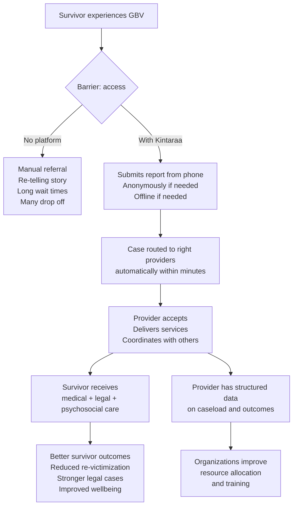

# Theory of Change

## The change we are trying to make

GBV survivors who seek help often do not receive it — not because the services do not exist, but because the path from crisis to care is fragmented, slow, and requires survivors to navigate a system that was not designed for them.

Kintaraa's theory of change is straightforward: **if the coordination infrastructure improves, more survivors receive timely, appropriate care.**

## Causal chain

## Assumptions

This theory of change depends on several conditions being true:

1. **Survivors have or can access a mobile phone.** The platform is mobile-first. Survivors without phone access cannot use it. Community health workers and partner organizations can act as intermediaries.

2. **Providers are enrolled and active.** The platform only works if providers are registered, trained, and responsive. An empty provider network produces no benefit.

3. **Providers respond within expected timeframes.** The assignment system assumes GBV rescue providers respond within 15 minutes for urgent cases. If providers consistently decline or go offline, the auto-assignment system degrades.

4. **Organizational trust is established.** Survivors must trust that reporting through the app is safe — that their data will not be used against them, shared with perpetrators, or accessed by unauthorized parties.

5. **Connectivity is sufficient for sync.** Fully offline operation is possible, but case routing requires the backend to be reachable at some point. Survivors in areas with no connectivity cannot sync their reports.

## Inputs → Activities → Outputs → Outcomes

| Level | Description |
|---|---|
| **Inputs** | Mobile app, backend infrastructure, trained providers, organizational partnerships, device access for survivors |
| **Activities** | Survivor report submission, automated case routing, provider assignment and acceptance, service delivery, messaging |
| **Outputs** | Number of incidents reported, cases assigned within target time, cases resolved, provider response rates |
| **Short-term outcomes** | Faster access to care, reduced time to medical treatment, more complete evidence for legal cases |
| **Medium-term outcomes** | Improved case completion rates, better provider coordination, survivors supported through full case lifecycle |
| **Long-term outcomes** | Reduced re-victimization, increased reporting rates, stronger institutional GBV response capacity |

## What Kintaraa does not change on its own

- **Root causes of GBV** — the platform is a response tool, not a prevention tool
- **Provider capacity** — if the healthcare system is under-resourced, the app cannot create more healthcare workers
- **Legal frameworks** — the platform can support legal case management, but cannot change laws
- **Survivor safety during active danger** — the platform provides emergency contacts and alerts, but cannot physically protect a survivor

These limitations are real. Kintaraa is most effective when deployed as part of a broader GBV response system that includes adequately resourced providers, survivor support networks, and functional legal and health institutions.

<!-- TODO: Add evidence base citations if outcome data becomes available from pilots or comparable platforms -->
