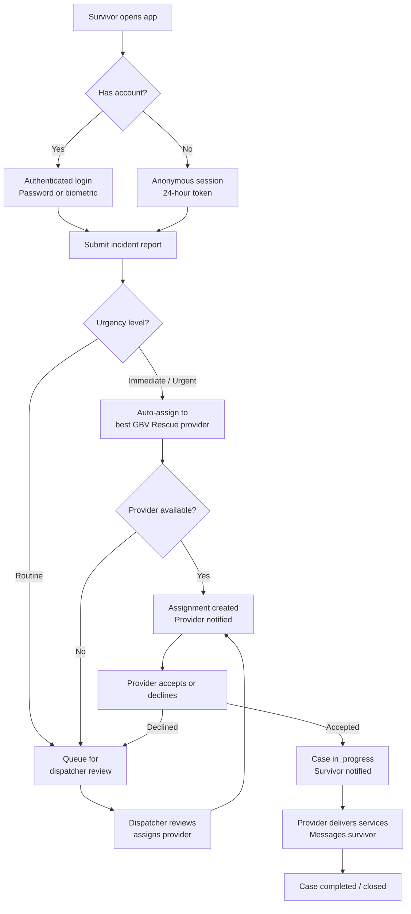

# How It Works

This page describes the end-to-end flow of a case through the Kintaraa platform, from the moment a survivor opens the app to case resolution.

## System overview



## Step-by-step flow

### 1. Survivor access

Survivors access the platform in two ways:

- **Registered account** — email and password, with optional biometric authentication (Face ID / fingerprint). JWT access tokens expire after 30 minutes; refresh tokens last 7 days.
- **Anonymous session** — no account required. The system creates a temporary session. Anonymous data is retained for 90 days.

### 2. Incident report

The report is a structured 5-step form. Fields captured include:

| Field | Type | Notes |
|---|---|---|
| Incident type | Enum | Physical, sexual, emotional, economic, online, femicide/attempted |
| Date and time | Date + time | When the incident occurred |
| Description | Text | Free-form account |
| Location | JSON | Address + coordinates (optional) |
| Severity | Enum | Low, medium, high |
| Support services requested | Multi-select | Healthcare, legal, police, counseling, social, emergency |
| Urgency | Enum | Routine, urgent, immediate |
| Voice recording | Audio file | Optional; stored separately |
| Anonymous | Boolean | Default false |

Each incident is assigned a unique case number in the format `KIN-YYYYMMDD-NNN` (e.g., `KIN-20260308-001`).

### 3. Assignment

The platform uses a hybrid assignment model — automatic for urgent cases, manual for routine cases.

**Automatic assignment (urgent/immediate):**

The system queries for GBV rescue providers who are:
- Active and currently available
- Below their maximum caseload
- Ordered by: lowest current caseload first, then fastest average response time

The first matching provider is assigned. If no provider is available, the case falls back to dispatcher review.

**Dispatcher review (routine):**

The case enters a queue visible to dispatchers. Dispatchers can see all available providers across types, sorted by availability and capacity, and assign one or more providers manually.

### 4. Provider response

When assigned, a provider receives a notification. They can:
- **Accept** — case moves to `in_progress`; survivor is notified
- **Decline** — with optional reason; case returns to the dispatcher queue

Providers manage their cases through type-specific dashboards. All providers on a case share access to the incident record.

### 5. Communication

Survivors and providers communicate through in-app messaging tied to the incident. Messages are scoped to the case and visible only to the assigned participants.

The messaging system uses WebSocket connections for real-time delivery when the device is online. Offline messages are queued and sent on reconnection.

### 6. Case lifecycle

Cases move through a defined set of statuses:

```
new → pending_dispatcher_review → assigned → in_progress → completed → closed
```

Status changes are logged. The survivor can view their case status at any time from their dashboard.

## Data flow: offline scenario

When a survivor is offline:

1. Report is saved locally to device storage with `syncStatus: pending`
2. Media files (voice recordings, photos) are saved to the device file system
3. A sync queue entry is created
4. When connectivity is restored, the sync service uploads the report and files
5. The server responds with a permanent case number and ID
6. Local records are updated; the UI reflects the synced state

Retry logic uses exponential backoff: immediate retry → 5 seconds → 30 seconds → 5 minutes.

## Multi-provider coordination

A single case can have multiple providers assigned — for example, a healthcare provider and a legal aid provider. Each provider sees the shared incident record and can send messages through the case chat. Coordination between providers is visible to all participants on the case.

<!-- TODO: Add WebSocket event reference once messaging system is fully documented -->
