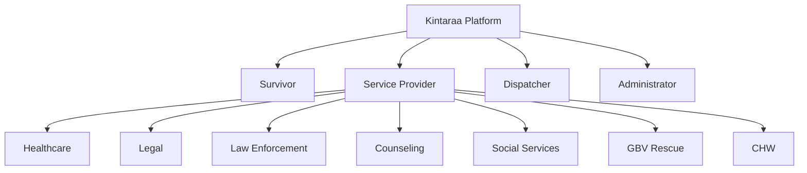

# Users

Kintaraa serves four distinct roles. Each role sees a different interface and has different permissions over data.

## Role overview

---

## Survivors

Survivors are individuals who have experienced gender-based violence and are seeking support. They are the primary users the platform is designed to protect.

**Account options:**
- Full account (email + password, optional biometric)
- Anonymous session (no account required; 24-hour session, 90-day data retention)

**What survivors can do:**
- Submit incident reports (with or without an account)
- View and track their own cases
- Communicate with assigned providers
- Manage safety plans and emergency contacts
- Track their wellbeing and journal privately
- Access resource recommendations

**What survivors cannot see:**
- Other survivors' data
- Provider internal notes (unless shared by the provider)
- Platform-wide case statistics

**Data scope:** Survivors have access only to their own incident records and assigned provider contacts.

---

## Service providers

Providers are professionals who respond to cases. All providers share the same authentication and core case management system. Each provider type is then given a specialized module.

**Account requirements:**
- Email + password (required)
- Provider type must be specified at registration
- Account activated by administrator or through organization onboarding

**The seven provider types and their specializations:**

### Healthcare providers
Doctors, nurses, and clinical staff who provide medical evaluation, treatment, and follow-up care for survivors.

Core workflow: receive case assignment → examine patient → create medical record → schedule follow-up.

Specific data access: patient list (survivors assigned to them), medical records, appointments.

### Legal professionals
Lawyers and paralegals who provide legal aid, help with protective orders, and represent survivors in legal proceedings.

Core workflow: receive case → assess legal options → file case → track court dates → manage documents.

Specific data access: their legal cases, court schedule, case documents.

### Law enforcement
Police officers who investigate incidents, collect evidence, and support prosecution.

Core workflow: receive case → log evidence → write report → track investigation status.

Specific data access: their assigned cases, evidence logs, chain-of-custody records.

### Counselors and therapists
Mental health professionals who provide trauma counseling and psychological support.

Core workflow: receive case → schedule session → record session notes → track client progress.

Specific data access: client list, session notes, therapy resources.

Note: Session notes are flagged as sensitive and planned for field-level encryption in the next development phase.

### Social services workers
Case workers who coordinate practical support — shelter, financial assistance, childcare, food security.

Core workflow: receive case → assess needs → allocate resources → track delivery.

Specific data access: resource allocation records, client list.

### GBV rescue centers
Organizations that provide emergency crisis response, hotline services, and shelter.

Core workflow: receive urgent assignment → coordinate emergency response → log outcome.

Specific data access: active emergency cases, response logs, hotline records.

GBV rescue providers are the first category used for automatic case assignment on urgent and immediate cases.

### Community health workers (CHW)
Field-based workers who conduct outreach in communities, often in areas with limited institutional services.

Core workflow: receive case → conduct field visit → log services provided → make referrals.

Specific data access: their outreach cases, visit logs, location-based case map.

CHW is the only provider type designed as mobile-primary; their interface is optimized for field use.

---

## Dispatchers

Dispatchers are GBV center staff who manage the incoming case queue and coordinate manual provider assignment.

**Responsibilities:**
- Review all routine cases (and urgent cases when no provider is auto-assigned)
- View real-time provider availability across all types
- Assign one or more providers to a case
- Monitor active case statuses
- Override or reassign existing assignments

**Data access:** Full view of all incident cases and all providers' availability and current caseload.

---

## Administrators

Administrators manage the platform itself. This role is currently handled through the Django admin interface.

**Capabilities:**
- User management (create, activate, deactivate accounts)
- Platform configuration
- Access to all cases and data (audit-logged)
- Report generation (planned)

**Note:** Administrative access is granted sparingly. All admin actions are intended to be audit-logged in a future release.

---

## Access control summary

| Data | Survivor | Provider (own cases) | Dispatcher | Admin |
|---|---|---|---|---|
| Own incident record | Read | Read | Read | Read |
| Other survivors' records | None | None | Read | Read |
| Case assignments | Read (own) | Read/Write (own) | Read/Write (all) | Read/Write |
| Provider profiles | None | Own only | Read (all) | Read/Write |
| Session notes / medical records | None | Own only | None | Read |
| Platform statistics | None | None | Limited | Full |
