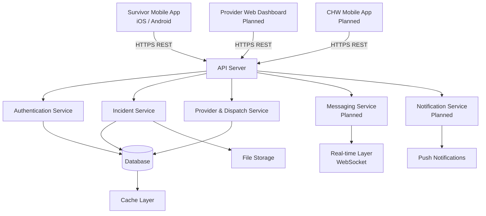
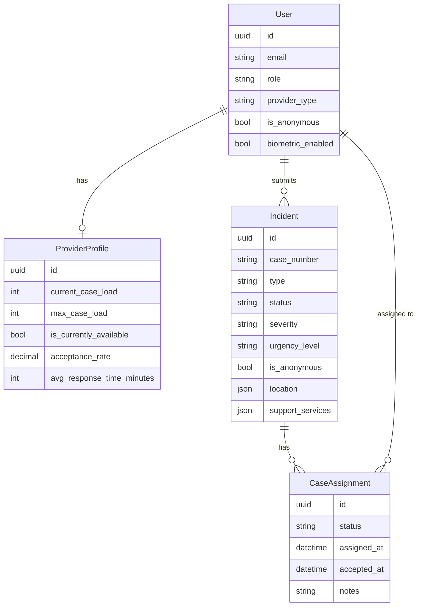
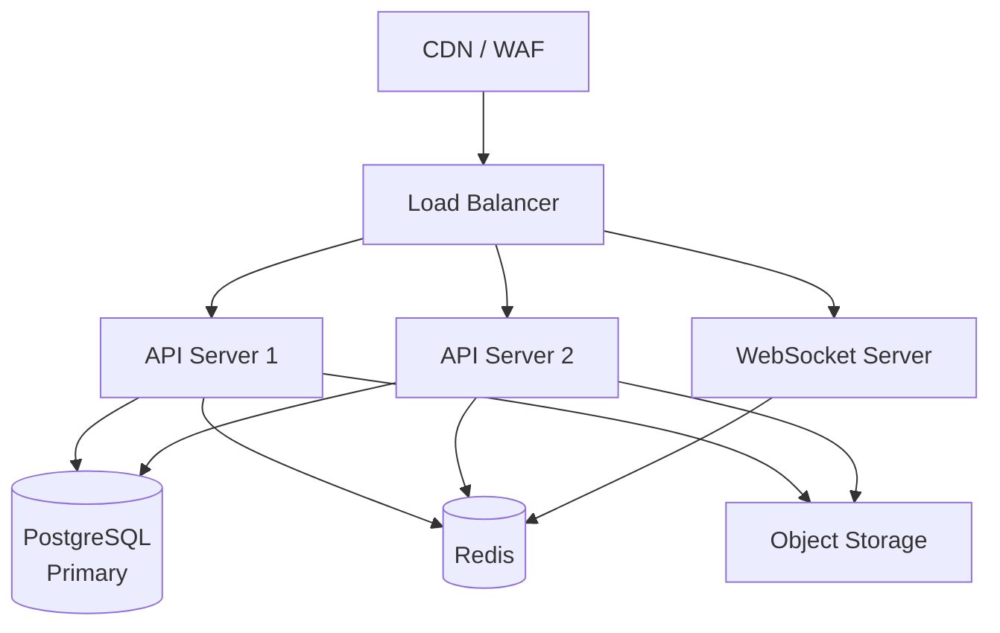

# Backend Architecture

This page describes the Kintaraa backend system: its components, how they fit together, and what each layer is responsible for.

## System overview

## Technology stack

| Component | Technology |
|---|---|
| API framework | Django + Django REST Framework |
| Real-time / WebSocket | Django Channels |
| Database | PostgreSQL (production), SQLite (development) |
| Cache | Redis |
| Background tasks | Celery |
| File storage | AWS S3 (or compatible object storage) |
| Push notifications | Firebase Cloud Messaging (FCM) |
| API documentation | OpenAPI / Swagger (auto-generated) |
| Deployment | Docker, Gunicorn, Uvicorn |

## Application modules

The backend is organized into focused application modules, each owning its own data models, business logic, and API endpoints.

### Authentication

Handles user registration, login, token management, and profile updates. Supports four roles: survivor, provider, dispatcher, and administrator. Providers additionally carry a specialization type (healthcare, legal, police, counseling, social, GBV rescue, CHW).

Biometric authentication is managed on the device; this module handles the server-side token lifecycle that biometric authentication unlocks.

### Incidents

Manages the full lifecycle of survivor incident reports — from creation through assignment, progress tracking, and closure.

Implements the hybrid assignment logic that routes urgent cases automatically to available GBV rescue providers, and queues routine cases for dispatcher review.

Case numbers are generated in the format `KIN-YYYYMMDD-NNN`, ensuring uniqueness and chronological sortability.

### Providers

Manages provider profiles, availability status, and capacity tracking. Provider profiles record current caseload, maximum caseload, average response time, and acceptance rate — the data used by the assignment system to select the best match.

### Dispatch

The dispatch module gives coordinators visibility across all pending cases and provider availability. It supports manual case assignment and override of automatic assignments.

### Messaging _(planned)_

Real-time messaging between survivors and their assigned providers, scoped to individual cases. Built on Django Channels for WebSocket support, with Redis as the channel layer for horizontal scalability.

### Notifications _(planned)_

Push notification delivery via Firebase Cloud Messaging. Triggers include: new case assignment, new message received, case status update, and appointment reminders.

## Data model overview

## Deployment architecture

### Development

Local Docker Compose setup with PostgreSQL and Redis containers. SQLite is supported as a zero-configuration alternative for initial development.

### Production (recommended)

- **API servers** run behind a load balancer, horizontally scalable
- **WebSocket server** uses Redis as the shared channel layer, enabling multiple WebSocket servers to coordinate
- **Database** is a managed PostgreSQL instance with automated backups and point-in-time recovery
- **Object storage** holds evidence files and voice recordings with private access and server-side encryption

### Environment configuration

All secrets and environment-specific configuration are managed through environment variables. No credentials are hardcoded. A reference list of required variables is provided to deploying organizations separately from the codebase.

## Offline sync protocol

The mobile app operates offline-first. When a survivor submits a report without connectivity, the data is held on-device in a local store with a sync queue. When connectivity is restored:

1. Pending records are uploaded to the API in order
2. The server returns permanent IDs; local records are updated
3. Media files are uploaded to object storage
4. The client pulls any updates from the server since its last sync timestamp

Retry logic uses exponential backoff. Data is never lost — if sync fails, it is retried automatically on the next connectivity event.

## API documentation

The backend auto-generates an OpenAPI specification from the endpoint definitions. This is available at:

- `/swagger/` — Swagger UI (interactive)
- `/redoc/` — ReDoc (readable reference)
- `/api/schema/` — Raw OpenAPI JSON

For the endpoint reference, see [API Reference](api-reference.md).
