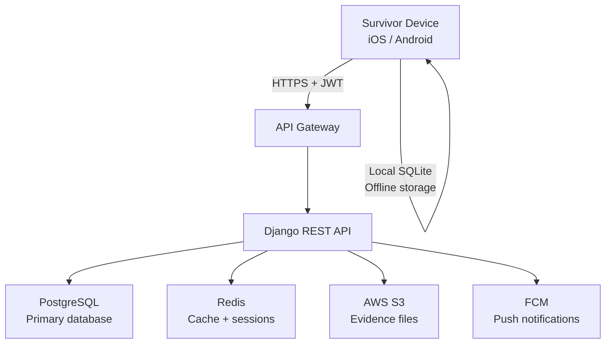

# Data Security

This page describes the security architecture of the Kintaraa platform: how data is protected at rest, in transit, and in access. It also documents what is not yet implemented and must be addressed before production deployment.

## System architecture



## Authentication

### Mobile app

Authentication is JWT-based with access and refresh tokens.

| Token | Lifetime | Storage |
|---|---|---|
| Access token | 30 minutes | AsyncStorage (encrypted key) |
| Refresh token | 7 days | AsyncStorage (encrypted key) |

On app start, the stored access token is validated against the backend via `GET /api/auth/profile/`. If validation fails (expired or revoked), the user is logged out and local credentials are cleared.

Logout blacklists the refresh token server-side using `djangorestframework-simplejwt`'s token blacklist.

### Biometric authentication

Biometric authentication (Face ID on iOS, fingerprint on Android) is available as a login method via `expo-local-authentication`. The biometric check is performed locally on the device by the OS — Kintaraa does not receive or store biometric data.

When biometric authentication succeeds, the existing stored credentials are used to make the API call. Biometric does not bypass server-side token validation.

Settings:
- Session timeout after biometric auth: 5 minutes
- Maximum failed attempts before fallback: 3

### Password requirements

```python
# apps/authentication/constants.py
MIN_PASSWORD_LENGTH = 8
PASSWORD_REQUIRE_UPPERCASE = True
PASSWORD_REQUIRE_LOWERCASE = True
PASSWORD_REQUIRE_NUMBERS = True
PASSWORD_REQUIRE_SPECIAL_CHARS = True
```

## Authorization (role-based access control)

Access to data is controlled at the Django API layer, not just the UI.

- Survivors can only access their own incident records
- Providers can only access cases assigned to them
- Dispatchers can access all cases and provider profiles
- Administrators have full access (all actions are logged)

Provider type is enforced at the model level: the `User` model requires that `provider_type` is set only when `role == 'provider'`, and validates this in `clean()`.

## Data in transit

All traffic between mobile app and backend uses HTTPS/TLS. HTTP is not supported in production configuration.

Logging redacts sensitive fields:

```python
# apps/authentication/views.py
safe_response = response_data.copy()
if "tokens" in safe_response:
    safe_response["tokens"] = "*** REDACTED ***"
if "password" in safe_response:
    safe_response["password"] = "*** REDACTED ***"
```

## Data at rest

### Backend database (PostgreSQL)

The database stores all incident records, user accounts, case assignments, and messages. Database-level encryption is the responsibility of the deployment infrastructure (e.g., AWS RDS with encryption at rest enabled).

Field-level encryption for high-sensitivity fields (counseling session notes, journal entries) is planned but not yet implemented.

### Evidence files (AWS S3)

Voice recordings and evidence photos are stored in a dedicated S3 bucket (`kintara-evidence-bucket`). Configuration:
- Bucket is private (no public access)
- Files are accessed via signed URLs (planned — expiration not yet configured)
- Server-side encryption using AWS S3 managed keys (SSE-S3)

### Mobile device storage

On-device data uses a three-tier storage model:

| Layer | Technology | Purpose | Encrypted? |
|---|---|---|---|
| Persistent data | AsyncStorage | Auth tokens, settings | Yes (configured sensitive keys) |
| Structured data | SQLite (planned: WatermelonDB) | Offline incident records | No (planned) |
| Media files | Expo FileSystem | Voice recordings, photos | No (OS-level only) |

**Current limitation:** Local encryption uses Base64 encoding as a placeholder. This provides obfuscation, not encryption. AES encryption via `expo-crypto` must be implemented before production.

## What is implemented

| Control | Status |
|---|---|
| HTTPS enforcement | Yes |
| JWT authentication with token blacklist | Yes |
| Biometric authentication (local, no biometric data stored) | Yes |
| Role-based access control (API level) | Yes |
| Password strength validation | Yes |
| Anonymous user support | Yes |
| Log redaction for tokens and passwords | Yes |
| CORS configuration | Yes |

## What must be implemented before production

| Control | Priority | Notes |
|---|---|---|
| AES encryption for local storage | Critical | Base64 placeholder must be replaced |
| SQLite encryption on device | Critical | WatermelonDB supports this |
| Signed S3 URLs with expiration | Critical | Prevents permanent URL exposure |
| End-to-end message encryption | High | Messages currently stored in plaintext |
| Field-level encryption (journal, session notes, medical records) | High | Particularly sensitive data |
| Virus scanning on file uploads | High | Before S3 storage |
| Rate limiting on authentication endpoints | High | Brute-force protection |
| Multi-factor authentication for providers | Medium | Especially law enforcement and healthcare |
| IP allowlisting for admin endpoints | Medium | Optional per deployment |
| Formal penetration test | Required before launch | |
| GDPR/data retention automation | Required for relevant jurisdictions | |

## Security configuration (environment variables)

The backend uses environment-variable-based configuration. No secrets are hardcoded. Key variables:

```
SECRET_KEY              Django secret key
JWT_SECRET_KEY          JWT signing key
DB_PASSWORD             Database password
AWS_ACCESS_KEY_ID       S3 access
AWS_SECRET_ACCESS_KEY   S3 secret
FCM_SERVER_KEY          Push notification key
FILE_ENCRYPTION_KEY     File encryption key (for future use)
```

See `kintara-backend/.env.example` for the full list of required variables.

## Incident response

<!-- TODO: Define incident response procedures — who is notified, what data is preserved, what actions are taken if a breach is detected. This is required before platform launch. -->

No formal incident response procedure is currently documented. This must be defined in partnership with the deploying organization before the platform handles real survivor data.
